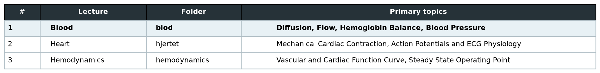

# Forord


[overview_files/shared_overview_table1.png](overview_files/shared_overview_table1.png)

Du kan få alle lectures i dette kursus ved at køre følgende linje i din terminal:

## Option 1: UV
>```
> uv run sync.py
>```
Denne vil download alle github repos inden i den mappe hvor du har sync.py, samt installerer et virtuelt environment som har alt hvad du skal bruge i dette kursus.

*Note: Denne funktion kræver at du har git og python installeret på din computer.*

## Option 2: Conda

>```
>conda create -n python314_st3_qhf python=3.14 -y
>conda activate python314_st3_qhf
>conda install --file requirements.txt -y
>python sync.py
>```

## Option 3: python+pip
>```
>python -m venv python314_st3_qhf
>python314_st3_qhf\Scripts\activate
>python -m pip install --upgrade pip
>python -m pip install -r requirements.txt
>python sync.py
>```


# KOMPLET FORELÆSNINGSPLAN – ST3 Kvantitativ Fysiologi - Det Cardiovascul;re system
Overblik over Cardiovasculær Modellings Forelæsningerne.

---
[overview_files/shared_overview_table1.html](overview_files/shared_overview_table1.html)



---


# Literatur Oversigt
Jeg elsker personligt gratis literatur.  *Specielt når det er lovligt.*

## Bøger
- [Think Python, 3rd Edition af Allen B. Downey (online bog)](https://allendowney.github.io/ThinkPython/)
- [Python for Everybody af Charles Severance (PDF)](https://do1.dr-chuck.com/pythonlearn/EN_us/pythonlearn.pdf)
- [Data Wrangling with Python (eBook/PDF)](https://datawranglingpy.gagolewski.com/datawranglingpy.pdf)
## Hjemmesider
- https://docs.python.org/3/library/index.html
- https://www.tutorialspoint.com/python/index.htm
- https://numpy.org/doc/stable/reference/index.html
- https://matplotlib.org/stable/
- https://scikit-learn.org/stable/
- https://docs.conda.io/projects/conda/en/stable/user-guide/index.html
